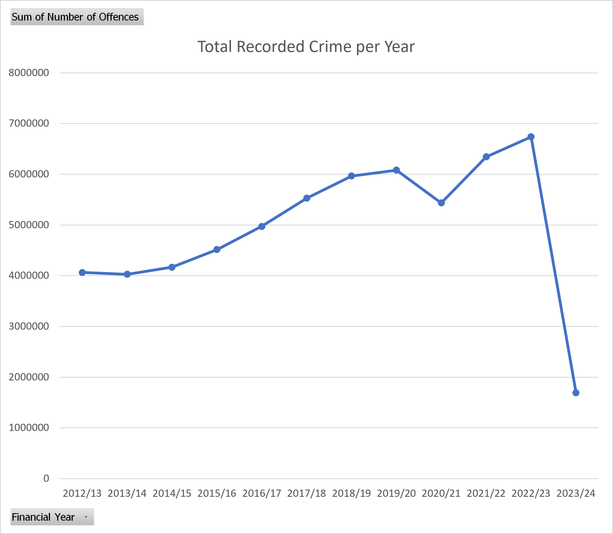
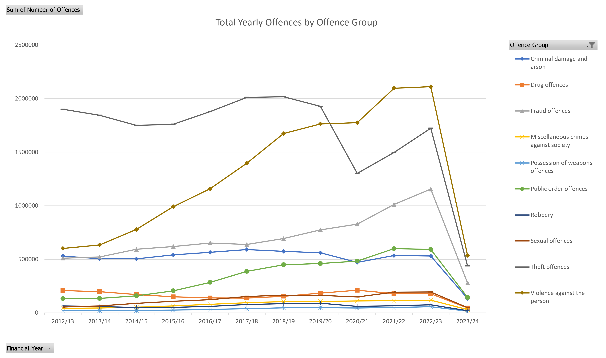
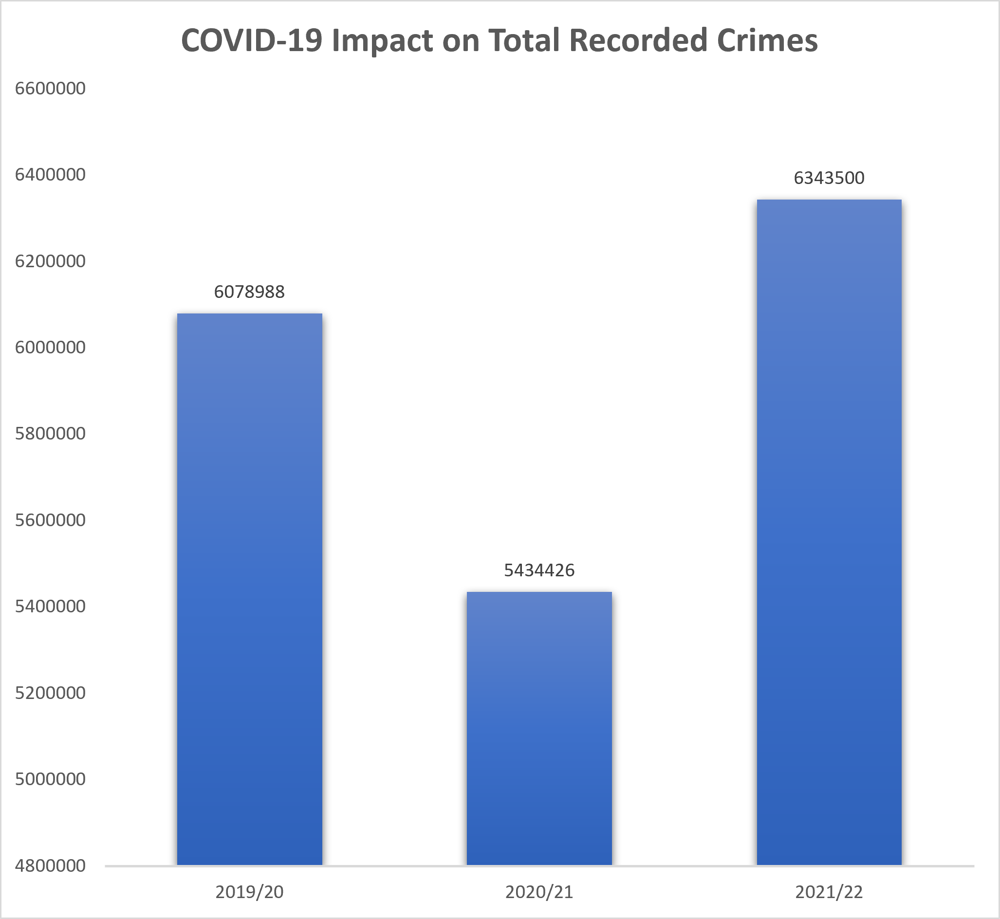
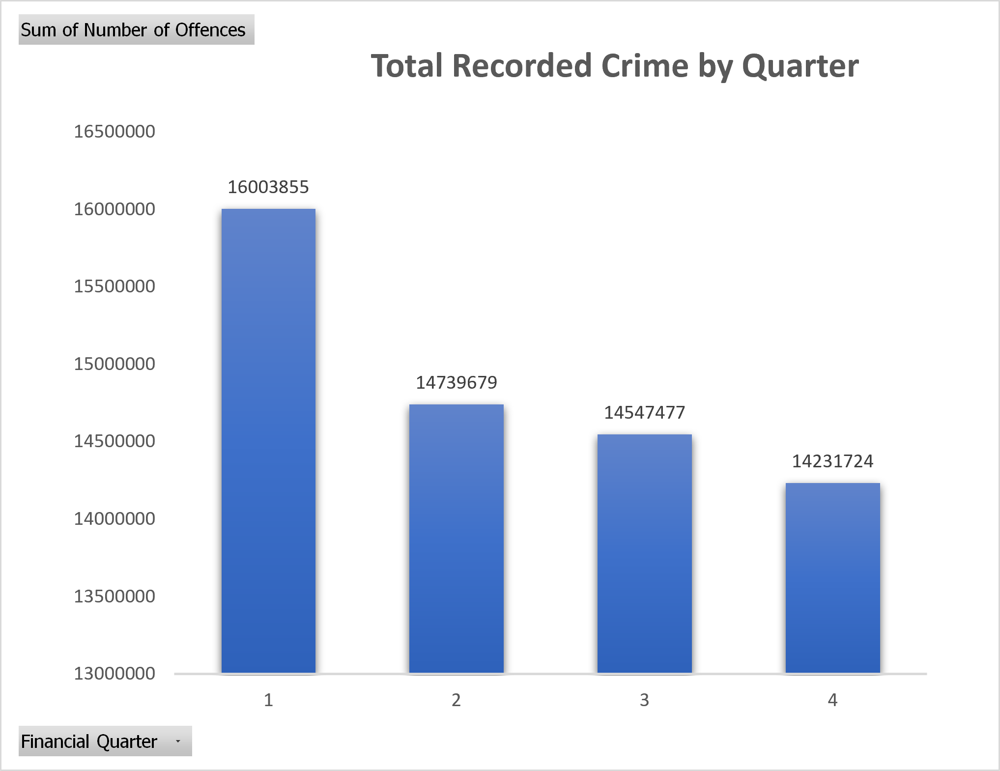
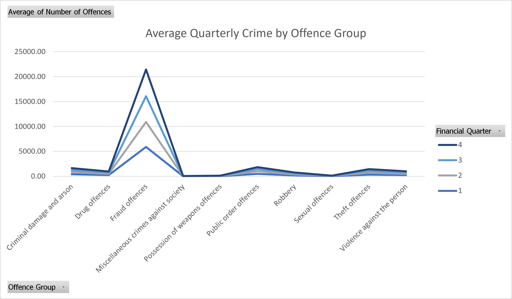
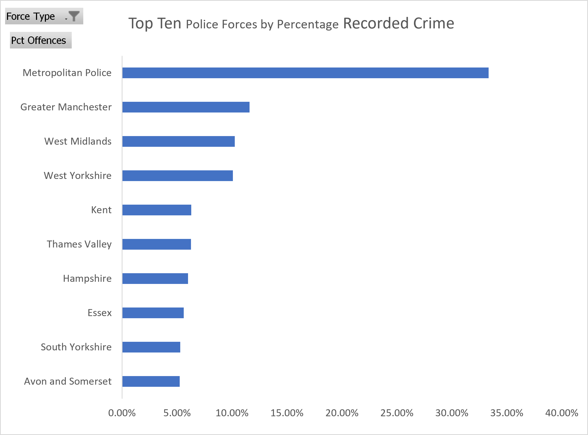

# UK-Police-Recorded-Crime-Analysis
Analysis of England &amp; Wales police recorded crime data (2012/13 - 2023/24) using Microsoft Excel
A comprehensive data analysis project examining police recorded crime trends across England and Wales over 12 financial years, using Microsoft Excel for data cleaning, transformation, analysis, and visualisation.

📌 Project Overview

This project analyses 258,906 records of police recorded crime data published by the UK Home Office, covering 44 territorial police forces across 12 financial years from 2012/13 to 2023/24. The analysis explores national trends, seasonal patterns, geographic distribution, and offence category deep-dives.

🎯 Objectives

Merge and clean 12 separate year-sheets into a single unified dataset using Power Query
Identify long-term trends in total recorded crime across England and Wales
Analyse the impact of COVID-19 on crime volumes
Examine seasonal patterns in crime by financial quarter
Compare crime volumes and trends across all 44 territorial police forces
Perform statistical analysis (mean, median, standard deviation, correlation) by offence group

## 🗂️ Dataset
 
| Attribute | Detail |
|---|---|
| **Source** | UK Home Office – Police Recorded Crime |
| **Coverage** | England and Wales |
| **Period** | 2012/13 – 2023/24 (12 financial years) |
| **Records** | 258,906 rows |
| **Forces** | 44 territorial police forces |
| **Columns** | 9 (Financial Year, Quarter, Force, Offence Group, Subgroup, Description, Code, Count, Force Type) |
| **Licence** | Open Government Licence v3.0 |
 
---
 
## 🛠️ Tools & Techniques
 
| Tool / Feature | Purpose |
|---|---|
| **Power Query** | Data import, cleaning, merging of 12 year-sheets, type conversion, trimming |
| **PivotTables** | Aggregation by year, force, offence group, and quarter |
| **Excel Charts** | Line, bar, stacked bar, and clustered bar visualisations |
| **Excel Formulas** | AVERAGEIF, COUNTIF, SUMIF, MINIFS, MAXIFS, STDEV, CORREL, IF, RANK |
| **Conditional Formatting** | Highlighting trends and outliers in summary tables |

## 📊 Key Findings
 
### 📈 National Trends
- Total recorded crime rose **65.8%** from 4.1 million (2012/13) to 6.7 million (2022/23)
- **Violence against the person** recorded the largest absolute increase (+251%), partly driven by improved recording practices from 2014/15
- **Fraud offences** showed the steepest proportional growth at **+126%** over the period
### 🦠 COVID-19 Impact
- Total crime fell **10.6%** in 2020/21 (from 6.08M to 5.43M offences) due to lockdown restrictions
- **Theft offences** were the most affected category, dropping sharply as shops closed and movement was restricted
- Crime rebounded strongly in 2021/22 (+16.7%) and continued rising through 2022/23
### 🗓️ Seasonal Patterns
- **Q1 (April–June)** is consistently the highest-crime quarter across all years
- **Q4 (January–March)** is consistently the lowest
- This pattern holds across most offence types, likely driven by warmer weather and increased outdoor activity in Q1
### 🗺️ Geographic Distribution
- The **Metropolitan Police** recorded 8,963,486 offences — **17.47%** of all territorial crime
- The Met's national share has **declined over time** as regional forces record faster growth
- **Greater Manchester, West Midlands** and **West Yorkshire** form the next tier of high-volume forces
### 📐 Statistical Highlights
- Large gaps between mean and median values across all groups reflect significant **right-skew**, driven by high-volume forces
- **Fraud offences** have the highest standard deviation (19,176.6), reflecting concentration in national fraud reporting bodies
- **Violence and Sexual offences** show strong positive correlation, rising in tandem across the period
---
 
## 📉 Charts Preview
 
### Total Recorded Crime Over Time

 
### Trends by Offence Group

 
### COVID-19 Impact

 
### Seasonal Pattern by Quarter

 
### Top 10 Police Forces

 
---
 
## ⚠️ Data Quality Notes
 
| Issue | Action Taken |
|---|---|
| 2016/17 columns incorrectly named | Corrected before merging |
| 2022/23 columns misarranged | Rearranged to match standard structure |
| Financial Quarter stored as text | Converted to Whole Number in Power Query |
| 426 rows with negative offence counts | Retained — represent legitimate Home Office recording reversals |
| 66,913 rows with zero offence counts | Retained — represent genuine absence of that crime type |
| No duplicate records found | Confirmed via Power Query deduplication |
| 2023/24 data incomplete (Q1 only) | Included in dataset but excluded from trend comparisons |
| CIFAS listed with inconsistent capitalisation | Standardised to "CIFAS" via Find & Replace |
 
---
 
## 📝 Report
 
The full written report (`report/Police_Crime_Analysis_Report.docx`) covers:
 
1. Executive Summary
2. Dataset Overview
3. National Trend Analysis
4. COVID-19 Impact Analysis
5. Seasonal Analysis
6. Geographic Analysis
7. Statistical Summary
8. Key Findings & Limitations
9. Conclusion & References
---
 
## 👩‍💻 Author
 
**Bilqis Oluwatoyin Abdullahi**
 
---
 
## 📜 Licence
 
The source data is published under the [Open Government Licence v3.0](https://www.nationalarchives.gov.uk/doc/open-government-licence/version/3/). All analysis, visualisations, and written content in this repository are the original work of the author.
 
